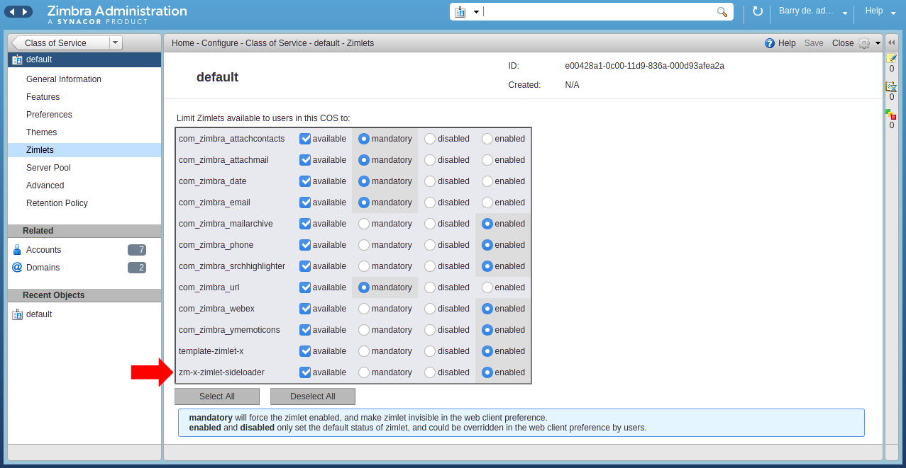
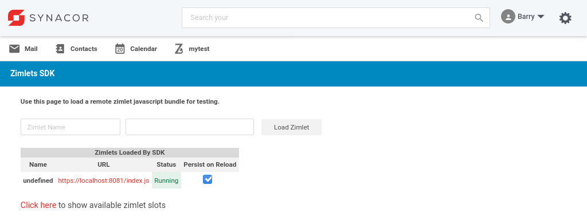
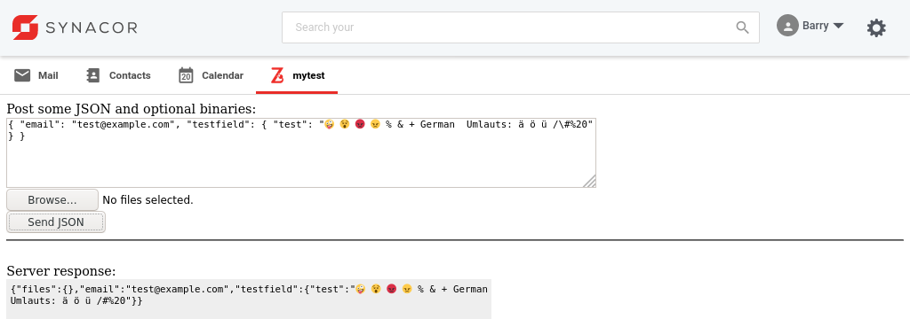
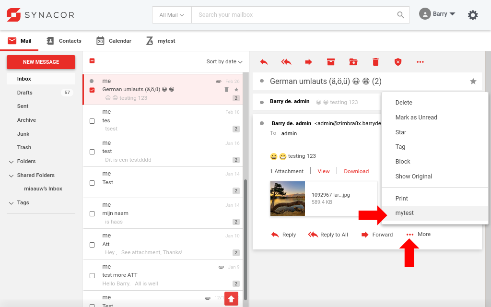
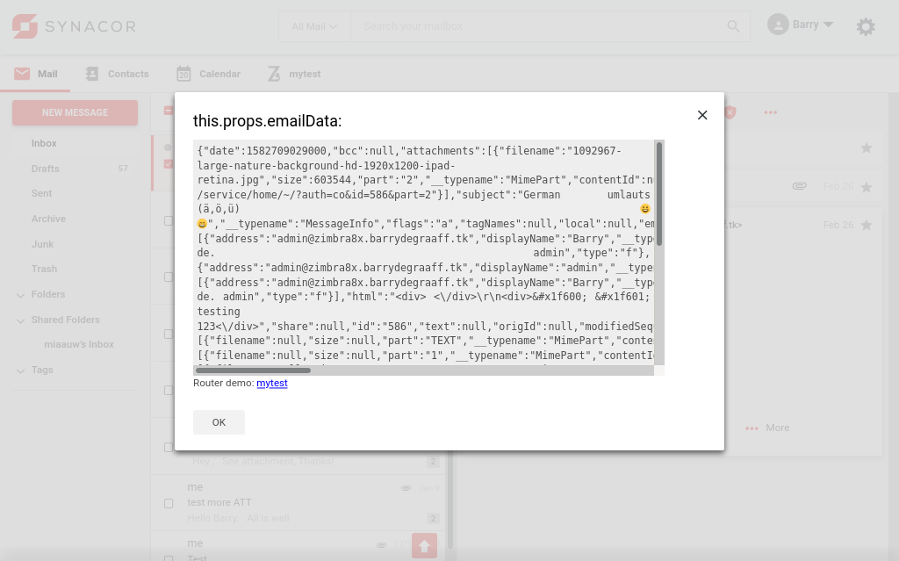
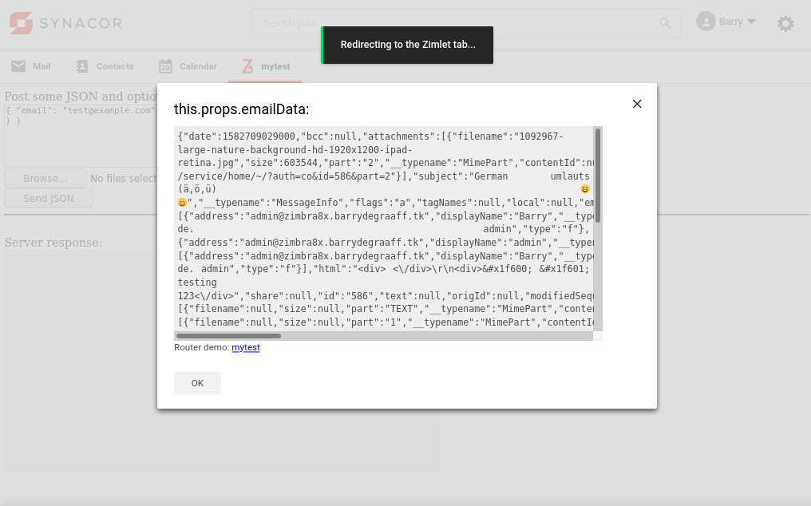
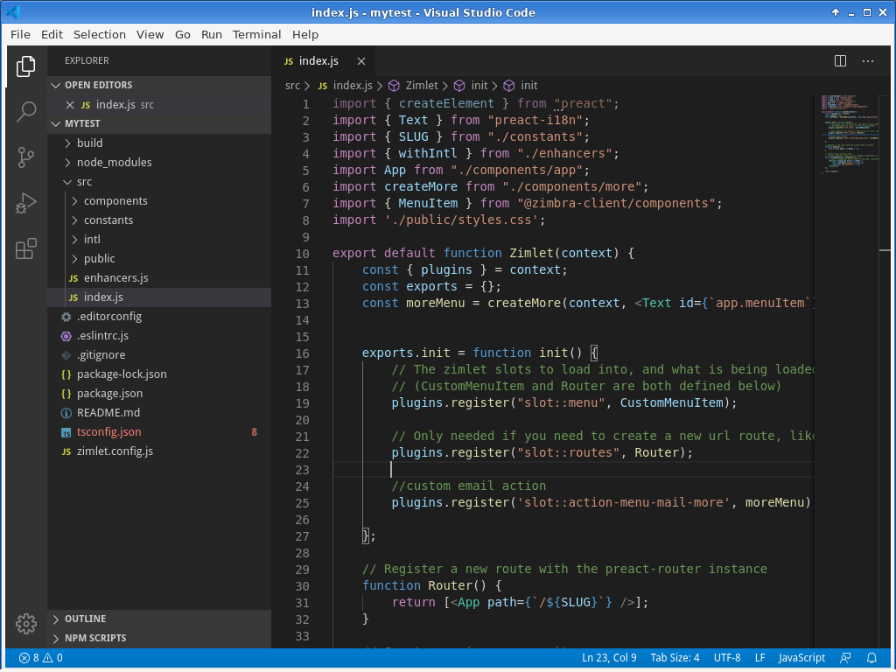
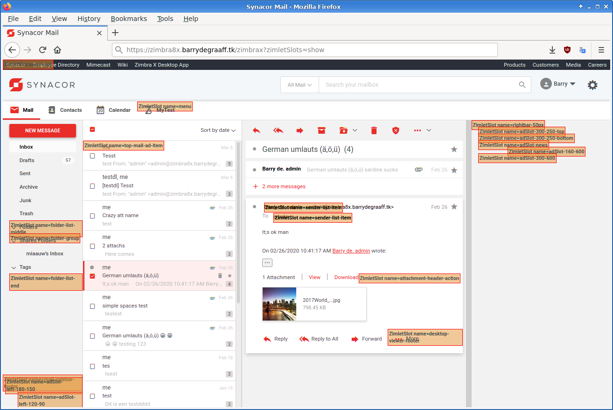

# Zimbra Preact Zimlet

One of the powers of Zimbra is the ability to be extended with custom functionality. The Zimbra front-end can be extended with JavaScript Zimlets and the back-end can be extended with Java extensions. This article is a practical guide to writing Preact Zimlets for Zimbra 9 and above.

Zimbra 9 introduces the so-called Modern UI. The Modern UI is fully responsive and based on Preact. Preact itself is based on React and that is a framework for building applications on Node JS. 

You will need to understand the basics of React, have some knowledge of ES6 JavaScript and NodeJS to be able to understand the sample code in this article. A good online course that can help you with these fundamentals can be found at https://www.udemy.com/course/the-complete-react-fullstack-course/

This article is part of a series. There is also a guide for back-end extensions at https://github.com/Zimbra/zm-extension-guide.

## Prerequisites 

To follow the steps in this article you need a Zimbra test server. You also need a version of Zimbra that includes the Modern UI. The Modern UI is included in Zimbra Network Edition version 9 and higher. You can set this up in a Virtual Machine in the cloud or you can install it on your local computer inside VirtualBox/KVM/Parallels etc. If you decide to set it up on your local computer you need at least an i5 with 16GB of RAM and a SSD. Your test server needs to be accessible over SSH. Instructions on how to set up your Zimbra server: https://blog.zimbra.com/2018/01/install-zimbra-collaboration-8-8-ubuntu-16-04-lts/ make sure to install the latest patches. You can find instructions on how to install patches at https://wiki.zimbra.com/wiki/Zimbra_Releases

## Deploy Mytest back-end

This article uses the `Mytest` back-end from the guide for back-end extensions at https://github.com/Zimbra/zm-extension-guide. Install a pre-compiled version to be sure you have it on your development server:

      sudo rm -Rf /opt/zimbra/lib/ext/mytest
      sudo mkdir /opt/zimbra/lib/ext/mytest
      wget https://github.com/Zimbra/zm-extension-guide/releases/download/0.0.2/mytest.jar -O /opt/zimbra/lib/ext/mytest/mytest.jar      
      su zimbra
      cd /tmp
      zmmailboxdctl restart

## Enable multipart/form-data on Zimbra Extensions

Enable multipart-config on your test server to enable processing of JSON and binary files in a single HTTP request. Append the following:

```xml
   <multipart-config>
   </multipart-config>
```

To the `ExtensionDispatcherServlet` in the files:

   - /opt/zimbra/jetty_base/etc/service.web.xml.in
   - /opt/zimbra/jetty_base/webapps/service/WEB-INF/web.xml

Restart Zimbra with `zmcontrol restart`. The final result looks like this on 8.8.15 patch 8:

```xml
  <servlet>
    <servlet-name>ExtensionDispatcherServlet</servlet-name>
    <servlet-class>com.zimbra.cs.extension.ExtensionDispatcherServlet</servlet-class>
    <async-supported>true</async-supported>
    <load-on-startup>2</load-on-startup>
    <init-param>
      <param-name>allowed.ports</param-name>
      <param-value>8080, 8443, 7071, 7070, 7072, 7443</param-value>
    </init-param>
  <multipart-config>
  </multipart-config>
  </servlet>
```

More information can be found in https://github.com/Zimbra/zm-extension-guide. 

## Deploy the Zimlet Sideloader

You need to deploy and enable the Zimlet Sideloader on your development server. You only have to do this step once. The Sideloader is installed like any other Zimlet with `zmzimletctl` from the Zimbra user:

      zmzimletctl deploy zm-x-zimlet-sideloader.zip


*Verify that the Sideloader Zimlet is available and enabled for your Zimbra Class of Service (CoS) by logging into the Admin UI -> Home -> Configure -> Class of Service.*


*Verify that the Sideloader Zimlet is available and enabled for your Zimbra and account by logging into the Admin UI -> Home -> Manage -> Accounts.*

## Installing Zimlet CLI

You can develop Zimbra Zimlets on any OS supported by NodeJS (https://nodejs.org/en/download/). This article will include Linux commands you can run on CentOS/Fedora/Redhat and Ubuntu. If you run on a different OS reading these commands should help you understand what you must do to get started. 

Zimbra provides a tool called Zimlet CLI that is based on Webpack. It is used for building/packaging your Zimlet and for working with Zimlet templates. Install it on your local computer:

As root:

      yum install nodejs
      apt install nodejs
      npm install -g @zimbra/zimlet-cli

## Zimlet CLI

After installing Zimlet CLI you will have the `zimlet` command that you can run from the command line. Use `--help` to get access to the built in documentation.

```
zimlet --help
Zimlet client tool for developing and building Zimlets.

Type "zimlet [commmand] --help" for command specific usage information

Commands:
  zimlet create [template] [dest]  Create a new zimlet.
  zimlet watch                     Start a development server
  zimlet build                     Compile a zimlet
  zimlet package                   Package a zimlet for deployment
```

You can also get command specific usage information:

```
zimlet create --help
zimlet create [template] [dest]

Create a new zimlet.

Options:
  --version      Show version number                                   [boolean]
  --help         Show help                                             [boolean]
  --cwd          A directory to use instead of $PWD.              [default: "."]
  --name         The zimlet's name
  --force, -f    Force `dest` directory to created if it already exists; will
                 overwrite!                           [boolean] [default: false]
  --yarn         Install with `yarn` instead of `npm` [boolean] [default: false]
  --git          Initialize a `git` repository        [boolean] [default: false]
  --install, -i  Install dependencies                  [boolean] [default: true]
  --template     Remote template to clone (user/repo#tag)
  --dest         Directory to create the zimlet
```

Zimlet CLI creates Zimlets from templates. Templates are downloaded from Github. To use a template from https://github.com/exampleuser/exampletemplate you should:

      zimlet create exampleuser/exampletemplate mytest

By default it downloads from *zimbra* so to use https://github.com/Zimbra/zm-x-zimlet-template-default you can do:

      zimlet create zm-x-zimlet-template-default mytest

At the end of this article there is a chapter that explains how to use templates from Bitbucket, Gitlab or any other (on-premise) versioning system. 

## Creating the mytest Zimlet

Create a folder on your local computer to store the `mytest` Zimlet:

      mkdir ~/zimbra_zimletx_course
      cd ~/zimbra_zimletx_course
      zimlet create zm-zimlet-guide mytest

Zimlet CLI will replace all occurrences of `{{name}}` in the template when it runs, but it has a bug and some files are skipped. We can manually patch those:

      cd mytest
      sed -i 's/{{name}}/mytest/g' src/constants/index.js
      sed -i 's/{{name}}/mytest/g' src/intl/en_US.json      

Next we can build the `mytest` Zimlet:

      zimlet build
      
Finally we can start a Webpack Dev server on our local machine:

      zimlet watch

The output of this command should be:

```
Compiled successfully!

You can view the application in browser.

Local:            https://localhost:8081/index.js
On Your Network:  https://192.168.1.100:8081/index.js
```

Visit https://localhost:8081/index.js in your browser and accept the self-signed certificate. The index.js is a packed version of the `mytest` Zimlet you just created. At the end of this article there is a chapter that explains how to use a valid SSL certificate. 

## Sideload the mytest Zimlet

Log on to your Zimbra development server and make sure that you are seeing the modern UI. Then append `/sdk/zimlets` to the URL.

> 
*Sideload the `mytest` Zimlet by clicking Load Zimlet. The Zimlet is now added to the Zimbra UI in real-time. No reload is necessary.*

> 
*Click on the mytest tab. If you followed the guide for back-end extensions this should look familiar. As what we see is an iframe that loads the extension from /service/extension/mytest.*

*Click the Send JSON button to send the HTML form to the back-end. The server will respond with a copy of the JSON data with added JSON elements for each file you uploaded.*


*Click the `mytest` menu item in the More menu.*


*The selected email is sent to the back-end in JSON format, and the contents is displayed in the modal dialog.*


*Click the `mytest` link in the dialog. This will show a demo toaster notification and switch to the `mytest` tab.*

Summary of the functionality implemented in the `mytest` Zimlet:

 - Create a new tab in the UI
 - Implement a More menu item
 - Show a modal dialog
 - Show a toaster notification
 - Redirect users by clicking a link

## Setting up Visual Studio Code

Visual Studio Code is an integrated development environment (IDE). It supports React out of the box and it will check your code for errors while you type it. It also has code auto-completion and automatic formatting of source files. There is a tutorial that shows you all NodeJS/React features: https://code.visualstudio.com/docs/nodejs/reactjs-tutorial

Go to https://code.visualstudio.com/ and install Visual Studio Code on your local computer.

To open the `mytest` Zimlet in Visual Studio Code click File -> Open Folder and select ~/zimbra_zimletx_course/mytest/


*Visual Studio Code with the `mytest` Zimlet loaded, pretty much works out of the box.*

## Getting Started

Zimlets are essentially Preact components that run in a sandbox within the Zimbra web application. Throughout the Zimbra application, there are hooks made available to Zimlets for injecting components into the application. These hooks are called ZimletSlots.

To see which slots are available in the UI, add `?zimletSlots=show` to the end of the URL of Zimbra. This will show all of the places in the active UI where ZimletSlots are available.



Slots that are not visible, such as the routes slot which allows for adding URL routes to screens in the app, will present a message in the browser console, such as:

      non-visible ZimletSlot name=routes
      non-visible ZimletSlot name=searchInputPlaceholder

The ZimletSlots will remain visible until the page is refreshed without zimletSlots=show in the URL.

Zimbra passes the Zimlet *context* object into every Zimlet when they are created. Context allows the Zimlet to interact with the main application by registering plugins. It allows the main application to pass data into the Zimlet. Zimbra passes the *context* only to the component defined in `src/index.js`. You need to pass the *context* to any additional components that need it. 

Here are some examples that show you how to work with *context*:

```javascript
//getAccount() is a function in the context object. It returns an object with current account name, id, display name and other account attributes:
context.getAccount()

//Get an object with the name 'plugins' from context and define it in the current scope:
const { plugins } = context;
//Call the register function from the 'plugins' object to register a Zimlet slot:
plugins.register('slot::action-menu-mail-more', moreMenu);

//Get a function with the name 'dispatch' from an object with the name 'store' and define in the scope
const { dispatch } = context.store;
//Call the dispatch function to show a modal dialog defined in this.modal.
dispatch(context.zimletRedux.actions.zimlets.addModal({ id: 'addEventModal', modal: this.modal }));
```

## Dependencies and shims

Re-usable components from the Zimbra application are made available to the Zimlet via shims. You can find the latest shims in `context.shims`. To use the `ModalDialog` function from the `@zimbra-client/components` shim you would import it like this:

```javascript
import { ModalDialog } from '@zimbra-client/components';
```
Please be aware that when you sideload a Zimlet, the shims are provided by Zimlet CLI from your local machine. These shims *may* differ from the ones in the Zimbra application. This will happen for example if outdated Zimlet CLI/shims and (node) modules are available on your local machine. It is recommended to test your work from time to time in a fresh environment. 

### Package.json and package-lock.json

Take a look at package.json and make sure you do not include dependencies that are already shimmed. Be aware that package-lock.json gets generated automatically from your package.json and as long as package-lock.json exists the dependencies from that file take precedence over package.json. package-lock.json does not automatically regenerate if you make changes to package.json!

## Gotchas

  - A lot of React code examples use setState to trigger re-rendering of components. Be careful when using it as it works asynchronous and avoid it if you can.
  - The Zimlet is Sandboxed and runs in a separate environment that feels like an iframe. Global variables like window.location can be accessed using window.parent.location.
  - Interacting with the DOM directly will not work in most cases as that is abstracted away by the framework. If you really must you can do things like  window.parent.querySelectorAll and window.parent.document.body.appendChild.

## Analyzing the Zimlet

Now that you have created a Zimlet and see it running in the UI. You can use Visual Studio Code to analyze the code to understand how the example Zimlet `mytest` works. Import statements can import components, json data, stylesheets etc. These imports can be dependencies provided by the Zimbra application/Zimlet CLI or be components from your Zimlet. Usually when an import starts with `./` or `../` it is a component from your Zimlet. Otherwise it is a dependency.

```javascript
//This is a dependency loaded from Zimbra:
import { createElement } from "preact";

//These are dependencies from our Zimlet sources:
import createMore from "./components/more";
import MoreMenu from '../more-menu';
```

## Zimlet index.js

The index.js in the root of your src folder will be called by Zimbra to load your Zimlet. This is where you configure what Zimlet slots to use and what routes to add to the application. A route is a location in the URL of your browser. Read the comments in code to learn more:

```javascript
//Load components from Zimbra
import { createElement } from "preact";
import { Text } from "preact-i18n";
import { SLUG } from "./constants";
import { withIntl } from "./enhancers";
import { MenuItem } from "@zimbra-client/components";

//Load the App component from our Zimlet
import App from "./components/app";
//Load the createMore function from our Zimlet component
import createMore from "./components/more";

//Load a style static stylesheet (Preact will not change this)
import './public/styles.css';

//Create function by Zimbra convention
export default function Zimlet(context) {
	//Get the 'plugins' object from context and define it in the current scope
	const { plugins } = context;
	const exports = {};
   
   //moreMenu stores a Zimlet menu item. We pass context to it here
	const moreMenu = createMore(context, <Text id={`app.menuItem`}/>);

	
	exports.init = function init() {
		// The zimlet slots to load into, and what is being loaded into that slot
		// (CustomMenuItem and Router are both defined below)
		plugins.register("slot::menu", CustomMenuItem);

		// Only needed if you need to create a new url route, like for a menu tab, or print, etc
		plugins.register("slot::routes", Router);
		
		//Here we load the moreMenu Zimlet item into the UI slot:
		plugins.register('slot::action-menu-mail-more', moreMenu);

	};

	// Register a new route with the preact-router instance
	function Router() {
		return [<App path={`/${SLUG}`} />];
	}

	// Create a main nav menu item.
	// withIntl should be used on every component registered via plugins.register().
	const CustomMenuItem = withIntl()(() => (
		// List of components can be found in zm-x-web, zimlet-manager/shims.js, and more can be added if needed
		<MenuItem responsive href={`/${SLUG}`}>
			<span className="appIcon"></span><b>
			<Text id={`app.menuItem`} /></b>
		</MenuItem>
	));

	return exports;
}

```
If you do not understand the use of `<>` and `{}` take a look at the at https://www.udemy.com/course/the-complete-react-fullstack-course/. 

## More menu


The `mytest` item in the More menu is registered in the main index.js with these lines of code:

```javascript
import createMore from "./components/more";
const moreMenu = createMore(context, <Text id={`app.menuItem`}/>);
```
`<Text>` is a helper component to get a string in the language preferred by the user. See `src/intl/en_US.json`. createMore is imported from `src/components/more/index.js` and is included here for reference:

```javascript
import { createElement } from 'preact';
import MoreMenu from '../more-menu';

export default function createMore(context, menuItemText) {
	return props => (
		<MoreMenu {...props}>{{context, menuItemText}}</MoreMenu>
	);
}
```

createMore is a wrapper around another component from our Zimlet called MoreMenu. The reason behind this has to do with the implementation of Zimbra. But also has to do with the difference between functional and class based components in (p)react and what you can pass to them.

The important thing to notice is that `createMore(context, <Text id={`app.menuItem`}/>` is a function call with the arguments *context* and *<text...>*. And those are called *context* and *menuItemText* in the createMore function. Then they are passed as children to the MoreMenu component and the props are passed on from the Zimbra application.

The MoreMenu component in `src/components/more-menu/index.js` takes care of the functionality of the menu but it also does the HTML rendering to actually show it. The *context* and *menuItemText* are stored to the instance of the class in the constructor. To find out what props are passed from Zimbra to the MoreMenu you can add a console.log(this.props) to the code. You will see that this.props.emailData will contain an object with the email data.

```javascript
export default class MoreMenu extends Component {
    constructor(props) {
        super(props);
        this.zimletContext = props.children.context;
        this.menuItemText = props.children.menuItemText;
    };
```

Open `src/components/more-menu/index.js` to find out how to:

 - Show a modal dialog
 - Show a toaster notification
 - Redirect users by clicking a link

## Zimlet tab
> 

Similar to to more menu a new tab is added to the UI. The `mytest` tab is registered in the main index.js with these lines of code:

```javascript
import { SLUG } from "./constants";
import { MenuItem } from "@zimbra-client/components";

const { plugins } = context;
plugins.register("slot::menu", CustomMenuItem);

// Register a new route with the preact-router instance
function Router() {
   return [<App path={`/${SLUG}`} />];
}

// Create a main nav menu item.
// withIntl should be used on every component registered via plugins.register(). You will see this in the App index.js file as well
const CustomMenuItem = withIntl()(() => (
   // List of components can be found in zm-x-web, zimlet-manager/shims.js, and more can be added if needed
   <MenuItem responsive href={`/${SLUG}`}>
      <span className="appIcon"></span><b>
      <Text id={`app.menuItem`} /></b>
   </MenuItem>
));
```
CustomMenuItem holds the HTML loaded into the slot and has the HTML link to our tab. `<MenuItem>` is a component that returns HTML and SLUG is a static string loaded from `src/constants/index.js`. The Router() function is what ties an instance of App to the url location of our tab.


## Packaging for Production

To create a Zimlet zip file to be used with `zmzimletctl deploy` you can use `zimlet package` command. The zip will be in the `pkg` folder:

      zimlet package -v 0.0.1 --zimbraXVersion ">=0.0.1" -n "mytest-zimlet" --desc "A test Zimlet"

## Use a trusted SSL certificate for Zimlet CLI

By default Zimlet-CLI will generate a self-signed certificate. Web browsers will give you the option to temporary trust the certificate by clicking `Accept the risk` or `Proceed to localhost (unsafe)`. From time to time browsers will require you to re-confirm trusting the certificate. Since the Sideloader Zimlet cannot answer trusts questions it will fail in the background when this happens. If you want you can install a trusted certificate so your work is not interrupted. This example uses Let's Encrypt:

      #stop your dev server by hitting CTRL+C or `killall node`
      cat /etc/letsencrypt/live/zimlets.example.com/privkey.pem > 
                 '/usr/local/lib/node_modules/@zimbra/zimlet-cli/node_modules/webpack-dev-server/ssl/server.pem'
      cat /etc/letsencrypt/live/zimlets.example.com/cert.pem >> 
                 '/usr/local/lib/node_modules/@zimbra/zimlet-cli/node_modules/webpack-dev-server/ssl/server.pem'
      export HOST=zimlets.example.com && zimlet watch


## Using Zimlet CLI templates from Bitbucket, Gitlab and others

You can use Zimlet CLI with Zimlet templates from Bitbucket, Gitlab, on premise git or a local folder. To do this you need to create a `master.tar.gz` in a folder structure like this:

```
~/.gittar/
└── github
    └── zimbra
        └── my-private-zimlet
            └── master.tar.gz
```

master.tar.gz must have a structure like below and the name of `my-private-zimlet` must correspond with the folder structure above. The `template` folder must be present:

```
master.tar.gz
└── my-private-zimlet
    ├── LICENSE
    └── template
        ├── package.json
        ├── README.md
        ├── src
        │   ├── components
        │   │   ├── app
        │   │   │   ├── index.js
        │   │   │   └── style.less
        │   │   ├── more
        │   │   │   └── index.js
        │   │   └── more-menu
        │   │       ├── index.js
        │   │       └── style.less
        │   ├── constants
        │   │   └── index.js
        │   ├── enhancers.js
        │   ├── index.js
        │   ├── intl
        │   │   └── en_US.json
        │   └── public
        │       └── styles.css
        ├── tsconfig.json
        └── zimlet.config.js
```

You can now invoke Zimlet CLI using:

      unshare -n -r zimlet create my-private-zimlet mynewzimlet -i false
      npm install

The *zimlet* command uses *gittar* to fetch a tgz compressed archive from Github. Gittar falls back to the locally available master.tar.gz because we have rejected network access to it by the use of the *unshare* command. Notice the additional option `-i false` to instruct Zimlet CLI not to install npm dependencies it will not work without network access. To install the dependencies we run `npm install` manually.

## Further reading

https://github.com/Zimbra/zimlet-cli/wiki
